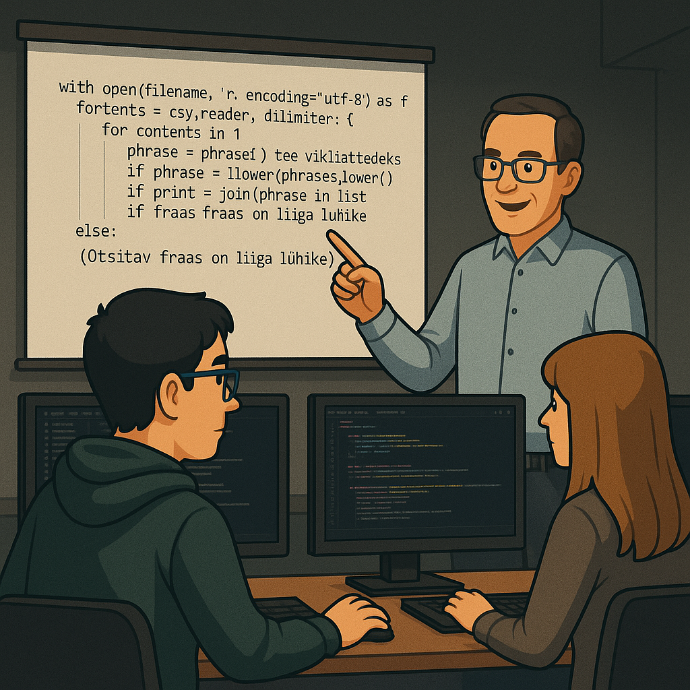

# kood

Siin on meie Skriptimise tunni teemad


## 📁 Struktuur

- `bash/` -
- `powershell/` - 
- `python/` -

# CyberSec LAB masina seadistus

See dokument kirjeldab sammud, kuidas seadistada Windowsi LAB masin, et oleksid olemas vajalikud tööriistad õppetööks ja harjutuste läbiviimiseks.

---

## 📚 Dokumentatsioon
- **Clientless VPN (Kehtna)**:  
  - Väline aadress: [gp.kehtnakhk.ee](https://gp.kehtnakhk.ee/)  
  - Koolivõrgu lokaalne aadress: [192.168.20.17](https://192.168.20.17/)

---

## ⚙️ LAB masina miinimumnõuded
- **CPU**: 4 tuuma  
- **RAM**: 8 GB  
- **HDD**: 100 GB  
- **OS**: Windows 11 (inglise keelne, *Date/Time English World*)  
- **Lisa brauser**: Firefox , Opera või Chrome

---

## 🔧 Vajalik tarkvara ja paigalduskäsud (PowerShell)

Kõik installid tehakse PowerShellis kasutades `winget` käsku.

### PowerShell 7
```powershell
winget install --id Microsoft.PowerShell --source winget
```

### Git (koos kasutajaandmetega)
```powershell
winget install --id Git.Git -e --source winget

git config --global user.email "ocrheiki@gmail.com"
git config --global user.name "ocrHeiki"

# soovituslikud seadistused:
git config --global init.defaultBranch main
git config --global core.autocrlf true
git config --global credential.helper manager
```

### Notepad++
```powershell
winget install -e --id Notepad++.Notepad++
```

### Visual Studio Code
```powershell
winget install -e --id Microsoft.VisualStudioCode
```

**VS Code laiendused (soovituslik):**
- Python  
- PowerShell  
- GitLens  
- GitHub Pull Request

### Python
```powershell
winget install -e --id Python.Python.3.11
```
> NB! Installimisel vali **Add python.exe to PATH**.

### 7-Zip
```powershell
winget install -e --id 7zip.7zip
```

---

## 🔑 (Valikuline) GitHub SSH-võti
```powershell
# loo võti (kasuta sama e-posti aadressi)
ssh-keygen -t ed25519 -C "ocrheiki@gmail.com"

# kuva avalik võti kopeerimiseks GitHubi (Settings → SSH and GPG keys)
type $env:USERPROFILE\.ssh\id_ed25519.pub
```

---

## ✅ Kontrollnimekiri
- [ ] Kontrolli, et **Python** töötab: `python --version`  
- [ ] Kontrolli, et **Git** töötab: `git --version`  
- [ ] Kontrolli, et **PowerShell 7** töötab: `pwsh --version`  
- [ ] Ava **VS Code** ja paigalda vajalikud laiendused  
- [ ] VPN testitud: [gp.kehtnakhk.ee](https://gp.kehtnakhk.ee/) ja [192.168.20.17](https://192.168.20.17/)

---

## 📦 Lisamaterjalid

### Pythoni õppematerjal
- [Pythoni õpik (progeopik.cs.ut.ee)](https://progeopik.cs.ut.ee/) – tasuta eestikeelne õppematerjal, mis sobib hästi programmeerimise algajatele.

### E-õppe kursused (metshein.com)
Portaal [metshein.com](https://metshein.com/) sisaldab tasuta eestikeelseid kursuseid. Õppejõud **Mario Metshein** oli minu varasem õpetaja eelmisest koolist.  

---

**Materjalid koostatud CyberSec kursuse LAB keskkonna jaoks.**
