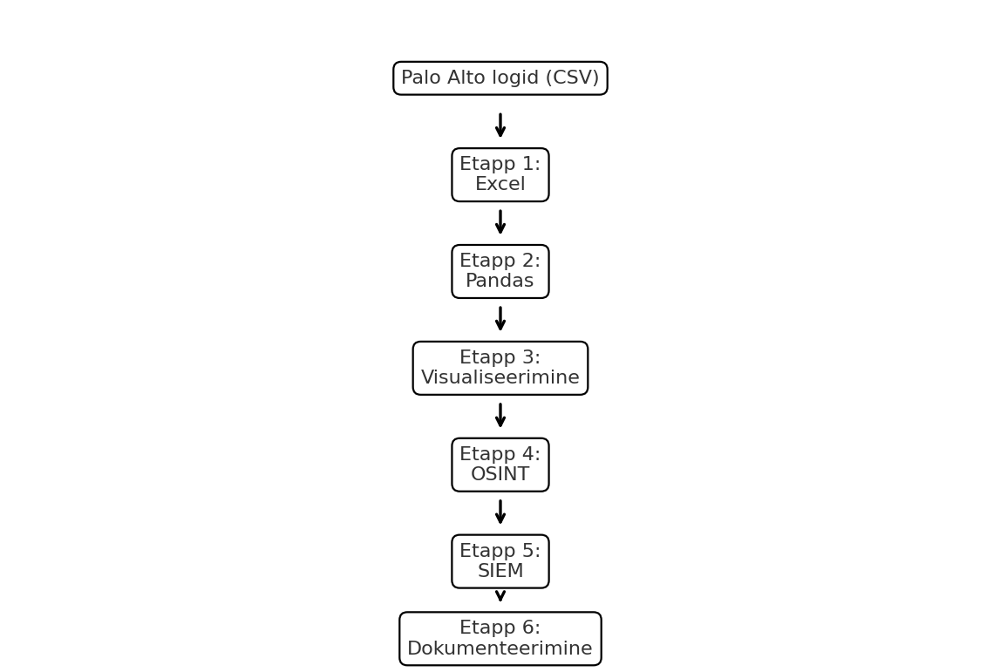

# SOC Palo Alto 24h — README

See on põhiülevaade SOC töövoost Palo Alto 24h logide analüüsimisel.  
Siit leiad kausta struktuuri ja iga etapi lühikese kirjelduse. Täpsemad sammud on kirjas eraldi failides.

---

## Kausta struktuur

```
SOC/
 ├─ README_PaloAlto_SOC.md     ← see fail (ülevaade)
 ├─ juhendid/                  ← samm-sammulised juhendid
 │   ├─ 01_excel_juhend.md
 │   ├─ 02_pandas_juhend.md
 │   ├─ 03_visualiseerimise_juhend.md
 │   ├─ 04_osint_juhend.md
 │   ├─ 05_siem_juhend.md
 │   ├─ 06_dokumenteerimise_juhend.md
 │   └─ vt_automaatkontroll.md
 └─ raportid/
     └─ palo_alto_24h_raport.md
```

---

## Töövoo etapid (lühikirjeldus)

### Etapp 1 — Excel
- Ava `log.csv` Excelis / Google Sheetsis  
- Sorteeri riskitasemed, lisa värvikoodid (🔴 🟧 🟨 🔵)  
- Salvesta eraldi filtrid (proxy, dns, ssl, smb)  
➡️ Täpsem juhend: `juhendid/01_excel_juhend.md`

### Etapp 2 — Pandas
- Täpsem filtreerimine (Risk >= 4, top IP-d)  
- DNS massilised päringud, SSL ühendused, SMB liiklus  
➡️ Täpsem juhend: `juhendid/02_pandas_juhend.md`

### Etapp 3 — Visualiseerimine
- Loo riskitasemete pirukas  
- Top Source/Destination IP graafikud  
- Sessions/hour ajajoon  
➡️ Täpsem juhend: `juhendid/03_visualiseerimise_juhend.md`

### Etapp 4 — OSINT
- Kontrolli IP-sid VirusTotal, AbuseIPDB, Shodan, Whois, SecurityTrails  
- Tõlgenda tulemused ja märgi severity  
➡️ Täpsem juhend: `juhendid/04_osint_juhend.md`

### Etapp 5 — SIEM
- Splunk/Elastic päringud (Risk >=4, DNS anomaaliad, SMB tööjaamade vahel)  
- Alertide loomine (Critical/High)  
➡️ Täpsem juhend: `juhendid/05_siem_juhend.md`

### Etapp 6 — Dokumenteerimine
- Täida kontrollnimekiri  
- Lisa graafikud ja OSINT tulemused raportisse  
- Märgi valepositiivid (pilveteenused, CDN, monitooring)  
➡️ Täpsem juhend: `juhendid/06_dokumenteerimise_juhend.md`

---

## Raport
- Kõikide sammude tulemused (24h kokkuvõte, top IP-d, riskitasemed) on kirjas failis:  
  `raportid/palo_alto_24h_raport.md`

---

## Severity värvid
- 🔴 Critical — kinnitatud intsident  
- 🟧 High — kiire uurimist vajav  
- 🟨 Medium — jälgida/korrelatsioon  
- 🔵 Low — benign / tavaline

---

✍️ Kasutamiseks:  
1. Alusta Excelist (Etapp 1).  
2. Mine Pandase juurde, kui vaja täpsemat analüüsi.  
3. Tee graafikud visualiseerimiseks.  
4. Kontrolli kahtlased IP-d OSINT-is.  
5. Lisa tulemused SIEM-i ja tee alertid.  
6. Dokumenteeri kõik raportisse.

---


### Etapp 7 — Raporti Mall
- Kasuta raporti malli igapäevase ja iganädalase kokkuvõtte jaoks.
- Sisaldab graafikute tegemise juhiseid, 24h võrdlust eelmise päevaga ja 7 päeva trendide kokkuvõtet.
- Märgi raportisse ka valepositiivid ja järeldused.
➡️ Täpsem juhend: `juhendid/07_raporti_mall.md`


## Raportite mallid ja checklistid

Raportite koostamiseks kasuta järgmisi faile kaustas `raportid/`:

- **24h Raporti mall (Markdown):** `raportid/palo_alto_24h_raport.md`
- **24h Raporti mall (puhas versioon):** `raportid/palo_alto_24h_raport_puhas.md`
- **7 päeva Raporti mall (Markdown):** `raportid/palo_alto_7paeva_raport.md`
- **24h Kontrollnimekiri:** `raportid/palo_alto_24h_checklist.md`
- **7 päeva Kontrollnimekiri:** `raportid/palo_alto_7paeva_checklist.md`

👉 Wordi failid (.docx) on samuti olemas, kuid Markdown-versioonid sobivad kasutamiseks otse GitHubis või turvakeskkonnas, kus allalaadimine pole lubatud.

## Töövoo skeem



```
Palo Alto logid (CSV)
        │
        ▼
 [Etapp 1] Excel → puhastamine ja filtreerimine
        │
        ▼
 [Etapp 2] Pandas → täpsem analüüs
        │
        ▼
 [Etapp 3] Visualiseerimine → graafikud (pirukas, tulp, jooned)
        │
        ▼
 [Etapp 4] OSINT → IP/domeenide kontroll
        │
        ▼
 [Etapp 5] SIEM → automaatsed alertid
        │
        ▼
 [Etapp 6] Dokumenteerimine → 24h & 7 päeva raportid
```
