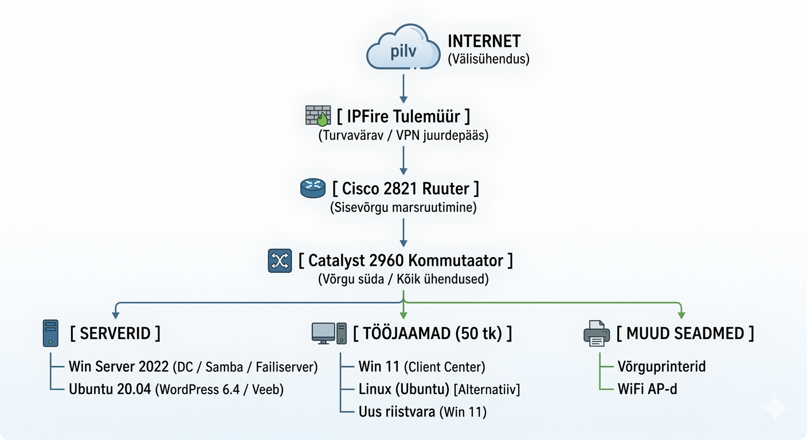

# MUUDATUSTE JA KONFIGURATSIOONI HALDUSE PLAAN
**Ettevõte:** Digitaalne Innovatsioon OÜ
**Koostaja:** [Sinu Nimi]
**Kuupäev:** 22. aprill 2026

---

## OSA 1 – PRAEGUSE OLUKORRA ANALÜÜS

### 1. Süsteemi kaardistamine

**Teenuste ja serverite nimekiri:**
| Teenus | Operatsioonisüsteem | Serveri roll | Kriitilisus |
| :--- | :--- | :--- | :--- |
| **Active Directory / Failiserver** | Windows Server 2012 | Domeenikontroller, Samba (failijagamine) | **KRIITILINE** |
| **Veebiserver (WordPress 6.3)** | Ubuntu 20.04 LTS | Ettevõtte veebileht, kliendiportaal | **KÕRGE** |
| **Võrguhaldus / VPN** | IPFire (Linux-põhine) | Tulemüür, VPN värav | **KRIITILINE** |
| **Sisevõrgu jagamine** | Cisco IOS | Marsruutimine ja kommuteerimine | **KRIITILINE** |

**Tööjaamad (50 tk):**
*   **Windows 10 (Data Center/Pro):** Suurem osa tööjaamu, mis vajavad kiiret väljavahetamist.
*   **Windows 11 (Client Center):** Uuemad masinad, mis on juba nõuetele vastavad.
*   **Ubuntu Linux:** Kasutusel arendusosakonnas.

**Võrgu loogiline skeem:**

Vastavalt lisatud joonisele on võrk üles ehitatud hierarhiliselt:
`INTERNET -> IPFire Tulemüür -> Cisco 2821 Ruuter -> Catalyst 2960 Kommutaator -> (Serverid / Tööjaamad)`.

### 2. Probleemianalüüs

*   **Windows Server 2012 turvalisus:** Toetus lõppenud 2023. aastal. Puuduvad turvapaigad -> suur ransomware oht.
*   **Windows 10 riskid:** Windows 10 tugi lõppeb 2025. aasta oktoobris. Arvestades ettevõtte suurust, tuleb üleminekut alustada kohe, et vältida turvaauke ja ühilduvusprobleeme.
*   **Riistvara ühilduvus:** Windows 11 nõuab TPM 2.0 moodulit. Vanemad Win10 masinad ei pruugi Win11-t toetada, mis tähendab vajadust uue riistvara järele.
*   **Ubuntu 20.04 & WordPress 6.3:** Vananenud versioonid, mis suurendavad veebirünnakute (SQLi, XSS) tõenäosust.
*   **Kuluarvutus (Seos päriseluga):** 2-päevane seisak 50-le töötajale maksaks ainuüksi palgafondis ca 12 000€, millele lisandub taastamiskulu ja kaotatud müügitulu.

---

## OSA 2 – MUUDATUSTE HALDUS (CHANGE MANAGEMENT)

### 3. Kavandatavad muudatused
1.  **Serveri upgrade:** Win Server 2012 -> Win Server 2022.
2.  **Tööjaamade upgrade:** Kõikide Win10 masinate viimine Win11 peale (koos riistvara väljavahetamisega vajadusel).
3.  **Tarkvara uuendus:** WordPress 6.3 -> 6.5+ (uusim stabiilne).
4.  **Turvameetmed:** MFA juurutamine kõikidele sisselogimistele.

### 4. Muudatuse dokument (Change Request)
*   **ID:** CR-2026-002 (Tööjaamade moderniseerimine)
*   **Kirjeldus:** Windows 10 asendamine Windows 11-ga.
*   **Mõju ärile:** Tagab katkematu töövoo ja vastavuse infoturbe standarditele pärast 2025. aasta sügist.
*   **Riskianalüüs:** Vanade rakenduste mitteühilduvus Win11-ga, kasutajate harjumine uue liidesega.
*   **Tagasipöördumisplaan:** Kasutajaandmete varundamine enne installi (OneDrive/Veeam). Ebaõnnestumisel ajutine asendusmasin.

### 5. CAB (Change Advisory Board)
*   **Rollid:** IT-juht (Heakskiit), Süsteemiadmin (Teostus), HR/Haldusjuht (Kasutajate teavitamine).
*   **Protsess:** Muudatused viiakse sisse lainetena (Deployment Waves): 1. Testgrupp (IT), 2. Pilootgrupp (1 osakond), 3. Ülejäänud ettevõte.

---

## OSA 3 – KONFIGURATSIOONIHALDUS (CONFIGURATION MANAGEMENT)

### 6. CMDB (Configuration Items) - Näidis
| CI ID | Nimi | Versioon | Status | Omanik |
| :--- | :--- | :--- | :--- | :--- |
| **PC-001** | Laptop-Admin | Windows 11 | Aktiivne | IT-Admin |
| **PC-045** | Desktop-Sales | Windows 10 | **Vananenud** | Müügijuht |
| **SRV-DC1** | Domain Controller | Win Server 2022 | Aktiivne | Süsteemiadmin |

### 7. Konfiguratsiooni kontroll
*   **Inventuur:** Kasutatakse Microsoft Intune-i või PDQ Inventory-t, et tuvastada automaatselt kõik Win10 masinad.
*   **ISO 27001 (A.8.9):** Tagatakse, et ainult lubatud operatsioonisüsteemi versioonid on võrgus lubatud (Network Access Control).

---

## OSA 4 – RAKENDAMINE

### 8. Tegevuste ajakava
*   **Kuu 1:** Inventuur ja riistvara võimekuse hindamine (TPM 2.0 kontroll).
*   **Kuu 2:** Uue riistvara hange (kui Win10 masinad on liiga vanad).
*   **Kuu 3:** Windows 11 puhtad installid ja andmete migratsioon.
*   **Kuu 4:** Windows Server 2022 juurutamine ja AD skeemi uuendus.

### 9. Turvanõuded
*   **TPM 2.0 & BitLocker:** Kohustuslik krüpteerimine kõikidel Windows 11 seadmetel.
*   **MFA:** Windows Hello for Business ja MFA juurutamine.

### 10. Juurdepääsuõiguste tabel (RBAC)
*   Põhineb rollidel (IT-Admin: Full Access, Töötaja: R/W oma failidele).

---

## OSA 5 – RESSURSID JA PERSONAL

### 11-13. Ressursid
*   **Tarkvara:** Windows 11 Pro litsentsid (läbi Microsoft 365 Business Premium paketi).
*   **Personal:** IT-tehnik (seadmete ettevalmistus), Süsteemiadmin (serverite migratsioon).
*   **Kestus:** Projekti kogukestus ca 6 kuud (et vältida tööhäireid).

---

## LISA – PRAKTILINE STSENAARIUM
**Probleem:** WordPressi uuendus rikkus kodulehe.
*   **Lahendus:** Aktiveeritakse Rollback snapshotist.
*   **Ennetus:** Edaspidi kasutatakse eraldiseisvat testkeskkonda (Staging) enne iga muudatust.
