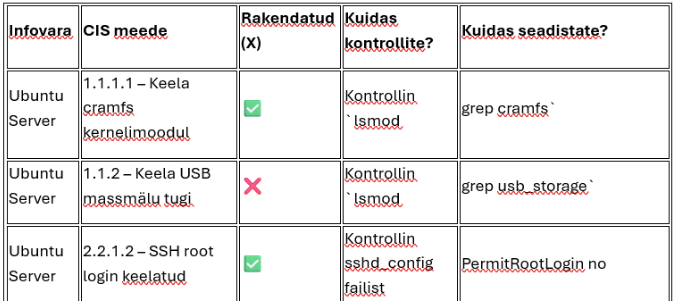

# E-ITS ja CIS Benchmarks
**Autor:** Triin Muulmann
---

- 100 punkti
- Ülesanne: Infovarade turvameetmete hindamine ja
rakendamine (E-ITS + CIS Benchmarks)

---
## Eesmärk:

Õppida analüüsima ja hindama oma virtuaalkeskkonnas olevate
infovarade (operatsioonisüsteemid ja teenused) infoturbe taset vastavalt:

E-ITS
(Eesti infoturbestandardi) nõuetele
CIS
Benchmarks soovitustele

b) Mis on CIS Benchmarks?

CIS Benchmarks on rahvusvahelised juhendid
turvameetmete seadistamiseks konkreetsetele süsteemidele (nt Windows Server,
Ubuntu, MySQL jne).

Need annavad samm-sammult soovitused, kuidas süsteem turvaliselt seadistada (nt
"keela anonüümne ligipääs", "lülita välja mittevajalikud
teenused", "aktiveeri tulemüür").

---
Praktiline osa

---
## Ülesanne 1: E-ITS põhine infovarade turvakontroll

###Sammud:

### Valige
3 virtuaalmasinat (nt Windows Server, Ubuntu Server, pfSense,
Debian jms).
### Valige
3 teenust (nt DHCP, DNS, failiserver, veebiserver, SQL server,
Active Directory).
### Koostage
tabel, kus on kirjas:
- infovara
- nimi
- rakendatavad
- turvameetmed (E-ITS põhjal)
kas
- meede on rakendatud (✅ / ❌
- / ei kohaldu)
kuidas
kontrollisite meedet
kuidas
seadistate vastavat meedet

---
🧾 Näidistabel – E-ITS
turvameetmete kontroll

---
## Ülesanne 2: CIS Benchmarks põhine süsteemi kontroll

### Sammud:

Vali
üks infovara (nt Ubuntu Server).
Ava CIS Benchmarks leht ja
vali sobiv juhend (nt CIS Ubuntu Linux 22.04 LTS Benchmark). Saad
siit vaadata https://github.com/jonathanbglass/cis-benchmarks
Vali
10 sinu arvates kõige olulisemat turvameedet.
Koosta
ja täida järgmine tabel.

🧾 Näidistabel – CIS
Benchmark meetmete kontroll

---
## 📋 Kokkuvõte / esitamise
nõuded:

### Esitada tuleb:

Täidetud
E-ITS meetmete tabel (3 OS + 3 teenust)
Täidetud
CIS Benchmark tabel (1 infovara, 10 meedet)
Lühike
kokkuvõte (0,5–1 lk), kus kirjeldad:
milliseid
probleeme avastasid kontrollimisel;
milliseid
meetmeid rakendasid või parandasid;
millised
on kõige olulisemad turvameetmed sinu süsteemis ja miks.
